# Introduction-to-Image-Processing

NTHU CS. 10910 CS452000 Introduction to Image Processing.

## Lab1

### Link
- [Problem link](http://www.imageprocessingplace.com/DIP-3E/dip3e_student_projects.htm)
- [Image link](http://www.imageprocessingplace.com/DIP-3E/dip3e_book_images_downloads.htm)

### Proj02-02
- Reducing the Number of Intensity Levels in an Image
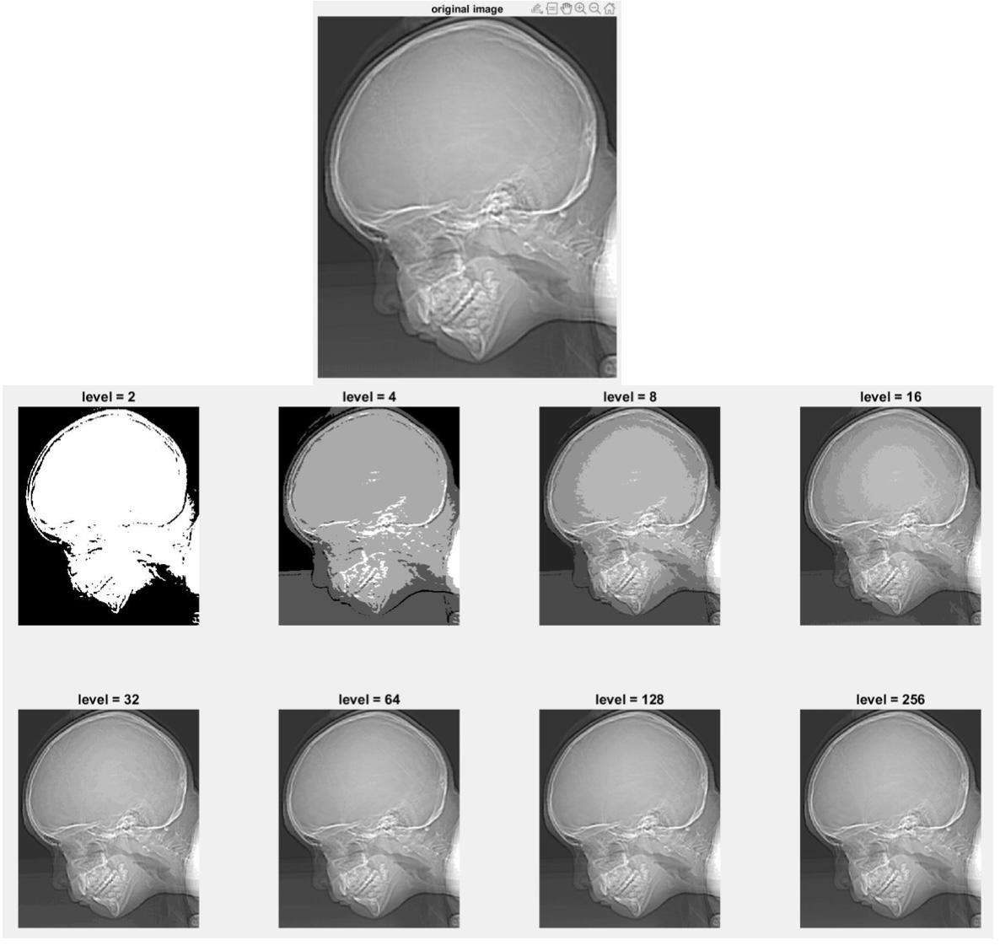

### Proj02-03
- Zooming and Shrinking Images by Pixel Replication
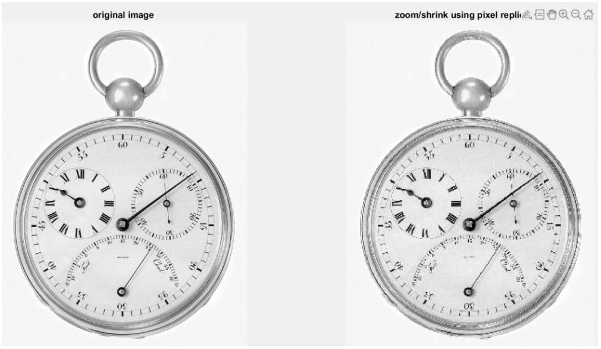

### Proj02-04
- Zooming and Shrinking Images by Bilinear Interpolation
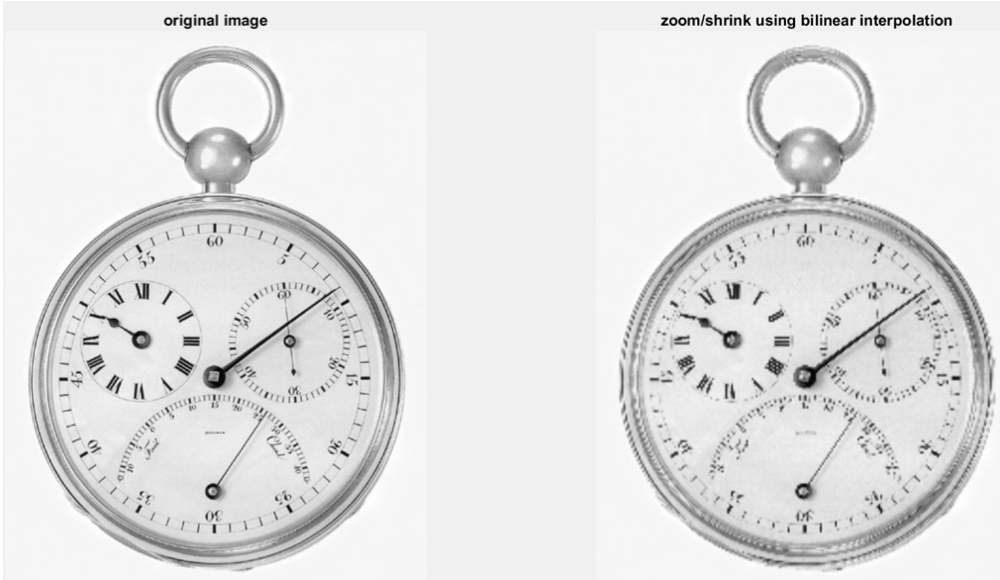

## Lab2

### Link
- [Problem link](http://www.imageprocessingplace.com/DIP-3E/dip3e_student_projects.htm)
- [Image link](http://www.imageprocessingplace.com/DIP-3E/dip3e_book_images_downloads.htm)

### Proj03-01 
- Image Enhancement Using Intensity Transformations
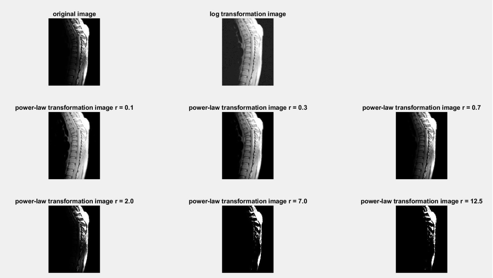

### Proj03-02 
- Histogram Equalization
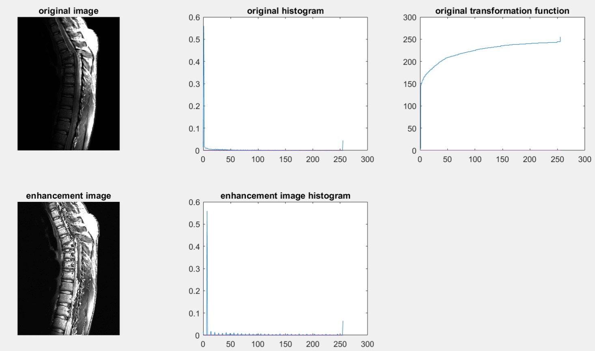

### Proj03-03 & Proj03-05 
- Spatial Filtering
- Unsharp Masking
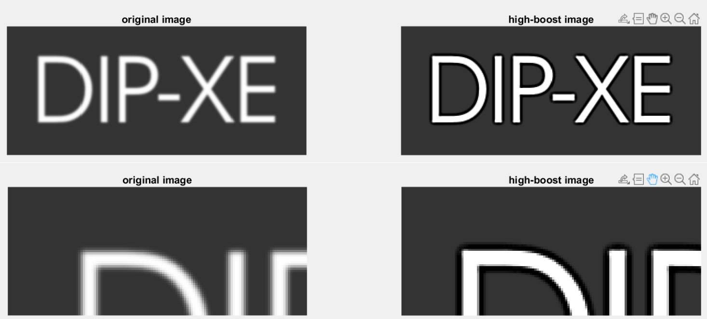

## Lab3

### Link
- [Problem link](http://www.imageprocessingplace.com/DIP-3E/dip3e_student_projects.htm)
- [Image link](http://www.imageprocessingplace.com/DIP-3E/dip3e_book_images_downloads.htm)

### Proj.04-01
- Two-Dimensional Fast Fourier Transform
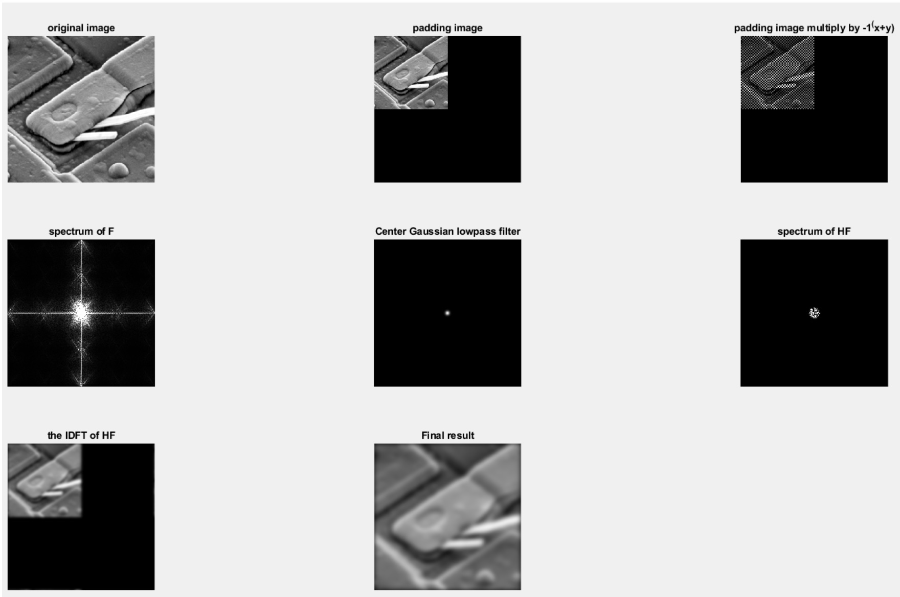

### Proj.04-02
- Fourier Spectrum and Average Value
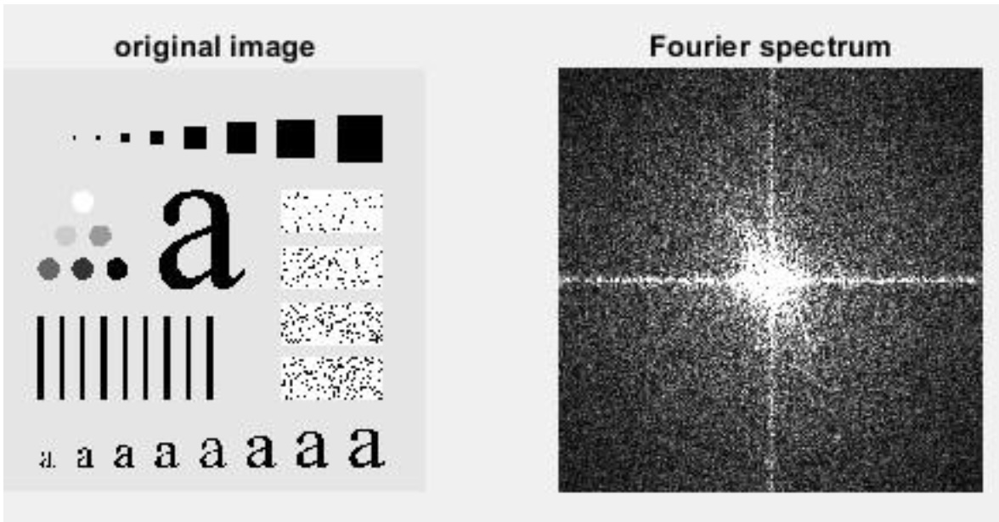 

### Proj.04-03 
- Lowpass Filtering
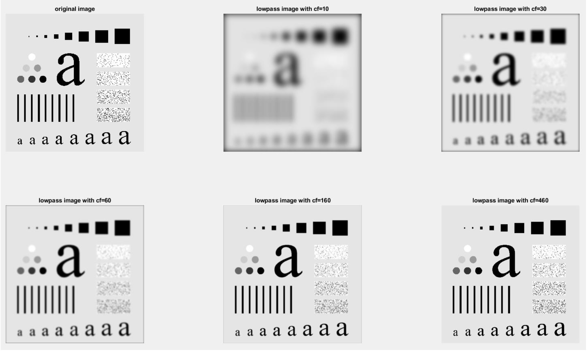

### Proj.04-04
- Highpass Filtering
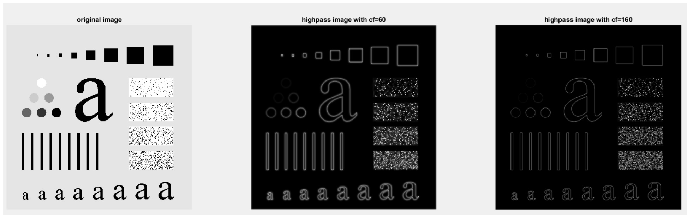

## Lab4

### Link
- [Problem link](http://www.imageprocessingplace.com/DIP-3E/dip3e_student_projects.htm)
- [Image link](http://www.imageprocessingplace.com/DIP-3E/dip3e_book_images_downloads.htm)

### Proj05-01
- Noise Generators
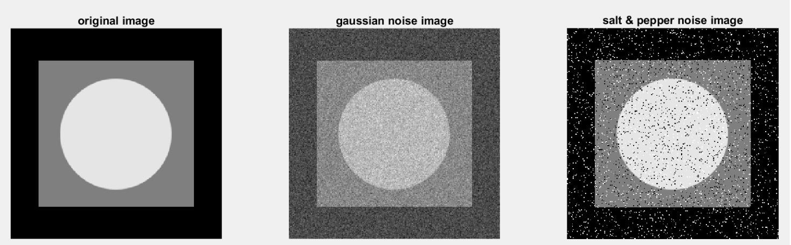

### Proj05-03
- Periodic Noise Reduction Using a Notch Filter
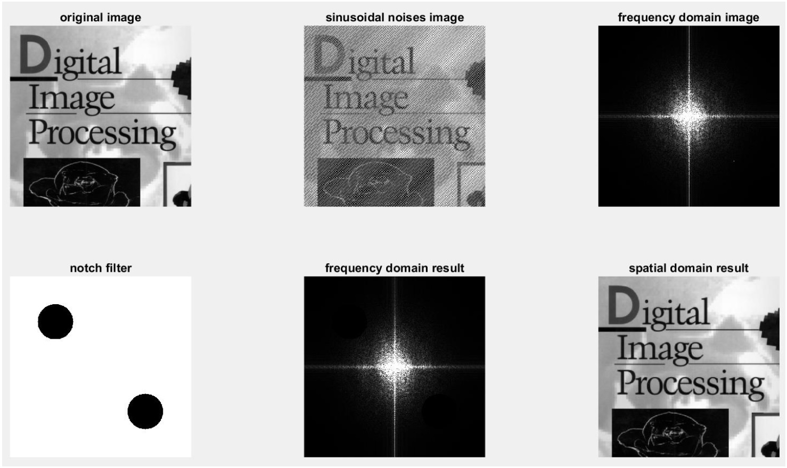

### Proj05-04
- Parametric Wiener Filter
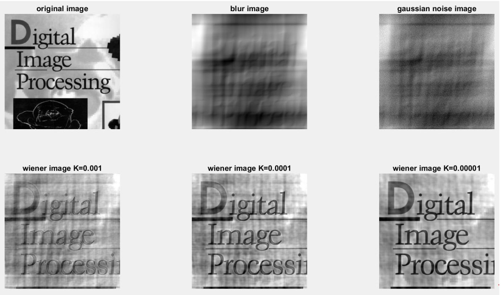
